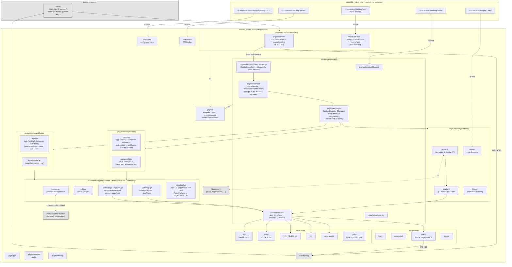

# Backend architecture

> Update this diagram when you change how the backend is structured.
> See [../CLAUDE.md](../CLAUDE.md) for what counts as "structural".

Two Go binaries in one repo: **coordinator** (the thin control plane) and **worker** (per-session emulator host). Both ship as one podman image; the container's entrypoint starts coordinator and supervises worker restarts.

Runtime deployment: moon bind-mounts `web/` and config.yaml; the container owns everything else in the image. The podman quadlet unit file lives at `systemd/cloudplay.container` in this repo and is the source of truth for `~/.config/containers/systemd/cloudplay.container` on moon.

## Notable invariants

- **Coordinator is the only thing clients talk to.** Workers never expose a public port; all traffic from a worker out goes through WebRTC (media/DC) or the coordinator WS fanout.
- **Auth trust boundary is Traefik**, not the app. `pkg/api/identity.go` reads `X-Auth-Request-*` headers set by oauth2-proxy (or the bypass middleware on `games-dev`). Never trust these headers when the coordinator is reachable directly.
- **GameSession identity**: each WS connection carries a pocket-id identity; on state-machine events (join/change-slot/leave) the worker re-broadcasts the full roster via `api.PT 207 (RoomMembers)` for every client.
- **Zero-copy video path**: Vulkan core → extmem → CUDA → NVENC, bypassing host CPU when the core renders via Vulkan. GL cores fall back to `readFramebuffer → yuv420 → encoder`.
- **One container, two processes**: coordinator and worker share the image. Dockerfile.run's CMD supervises worker restarts; a hard crash keeps coordinator alive and the supervisor forks a fresh worker.
- **Bind-mounted paths** let a `web/` rsync deploy in seconds, a config.yaml edit + `systemctl restart` avoid a rebuild, and ROM/core/save directories be managed independently of the image.
- **GPU access uses CDI** (`AddDevice=nvidia.com/gpu=all`), not hand-curated driver-versioned bind mounts, so the quadlet survives NVIDIA driver upgrades without edits.
- **Native-process backends unified via `pkg/worker/caged/nativeemu`**: `xemu` (original Xbox) and `flycast` (Sega Dreamcast) each run their emulator as an external OS process alongside libretro. Both compose the shared `nativeemu.{Process, Xvfb, Videocap, PipeWireSession, Audiocap, VirtualPad}` primitives rather than duplicating plumbing. `caged.Manager` dispatches on `ModName` (`libretro` / `xemu` / `flycast`); `app.App` is the shared contract so `room/` and `media/` stay backend-agnostic. Video capture: `ffmpeg -f x11grab` pipe reading the emu's Xvfb display — the original LD_PRELOAD GL hook captured xemu's offscreen ImGui context rather than the game output, see `docs/capture-path-not-taken-ld-preload.md`. Audio: each cage spawns its own pipewire+wireplumber+pipewire-pulse triplet under a private `XDG_RUNTIME_DIR`, the emu connects via SDL pulse, and parec feeds 48 kHz S16LE chunks through app.Audio at 100 Hz (10 ms chunks). Input: pure-Go uinput device emulating Microsoft Xbox 360 vid/pid (045e:028e) with xpad-style button codes — SDL's built-in gamecontrollerdb mapping applies automatically in both emulators. `HandleGameStart` routes via an effective-backend switch: per-launch `?backend=<modname>` query param wins, then the library-scan `GameMetadata.Backend`, else the default libretro path. Save/Load/Reset handlers gate on `room.IsLibretro(r.App())` and return `ErrPacket` for non-libretro backends. Stub frame emitter is parked on the first live frame so the room only ever sees one stream. Native backends stay off by default (`xemu.enabled: false`, `flycast.enabled: false`).
- **Backend override precedence**: `CLOUDPLAY_BACKEND_<SYSTEM>` env var (deploy-wide) → config.yaml core `backend:` field (per-system default captured at library scan) → per-launch `?backend=<modname>` query param from the browser (wins at dispatch time). Empty at every layer falls through to libretro. The env-var and config layers both resolve inside `Emulator.GetBackend(system)`; the per-launch layer is applied in `HandleGameStart` against `rq.Backend`.
- **uinput permissions on host**: `/dev/uinput` must be writable by the container's mapped user. The `systemd/99-cloudplay-uinput.rules` udev rule enforces `GROUP=input, MODE=0660` on both `/dev/uinput` and event nodes that match our virtual-pad names. Rootless podman needs either (a) the `input` gid in the user's `/etc/subgid` + `PodmanArgs=--group-add keep-groups`, or (b) the node chowned to the rootless user. Option (b) is tested/documented; option (a) is the long-term fix.
