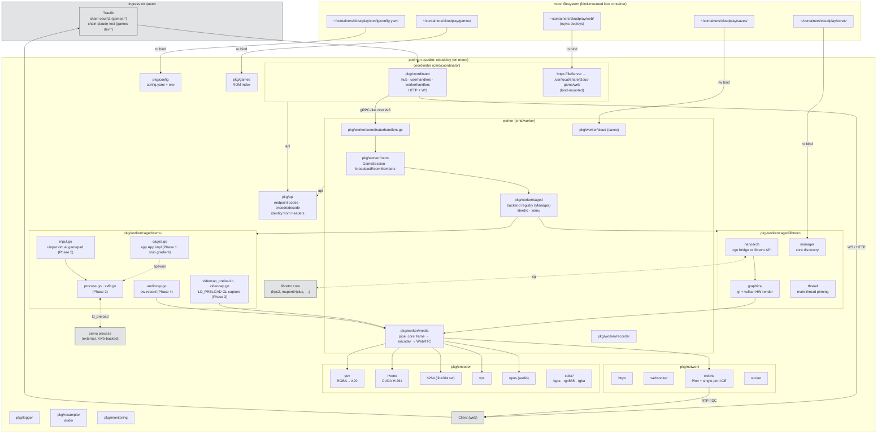

# Backend architecture

> Update this diagram when you change how the backend is structured.
> See [../CLAUDE.md](../CLAUDE.md) for what counts as "structural".

Two Go binaries in one repo: **coordinator** (the thin control plane) and **worker** (per-session emulator host). Both ship as one podman image; the container's entrypoint starts coordinator and supervises worker restarts.

Runtime deployment: moon bind-mounts `web/` and config.yaml; the container owns everything else in the image. The podman quadlet unit file lives at `systemd/cloudplay.container` in this repo and is the source of truth for `~/.config/containers/systemd/cloudplay.container` on moon.

## Notable invariants

- **Coordinator is the only thing clients talk to.** Workers never expose a public port; all traffic from a worker out goes through WebRTC (media/DC) or the coordinator WS fanout.
- **Auth trust boundary is Traefik**, not the app. `pkg/api/identity.go` reads `X-Auth-Request-*` headers set by oauth2-proxy (or the bypass middleware on `games-dev`). Never trust these headers when the coordinator is reachable directly.
- **GameSession identity**: each WS connection carries a pocket-id identity; on state-machine events (join/change-slot/leave) the worker re-broadcasts the full roster via `api.PT 207 (RoomMembers)` for every client.
- **Zero-copy video path**: Vulkan core → extmem → CUDA → NVENC, bypassing host CPU when the core renders via Vulkan. GL cores fall back to `readFramebuffer → yuv420 → encoder`.
- **One container, two processes**: coordinator and worker share the image. Dockerfile.run's CMD supervises worker restarts; a hard crash keeps coordinator alive and the supervisor forks a fresh worker.
- **Bind-mounted paths** let a `web/` rsync deploy in seconds, a config.yaml edit + `systemctl restart` avoid a rebuild, and ROM/core/save directories be managed independently of the image.
- **GPU access uses CDI** (`AddDevice=nvidia.com/gpu=all`), not hand-curated driver-versioned bind mounts, so the quadlet survives NVIDIA driver upgrades without edits.
- **Second backend via native process**: `pkg/worker/caged/xemu` runs xemu as an external OS process alongside libretro. `caged.Manager` dispatches on `ModName` (`libretro` / `xemu`); `app.App` is the shared contract so `room/` and `media/` stay backend-agnostic. As of Phase 1 the xemu backend is a frame-generating stub; Phase 2+ adds real process / capture / input primitives. xemu stays off by default (`xemu.enabled: false`).
