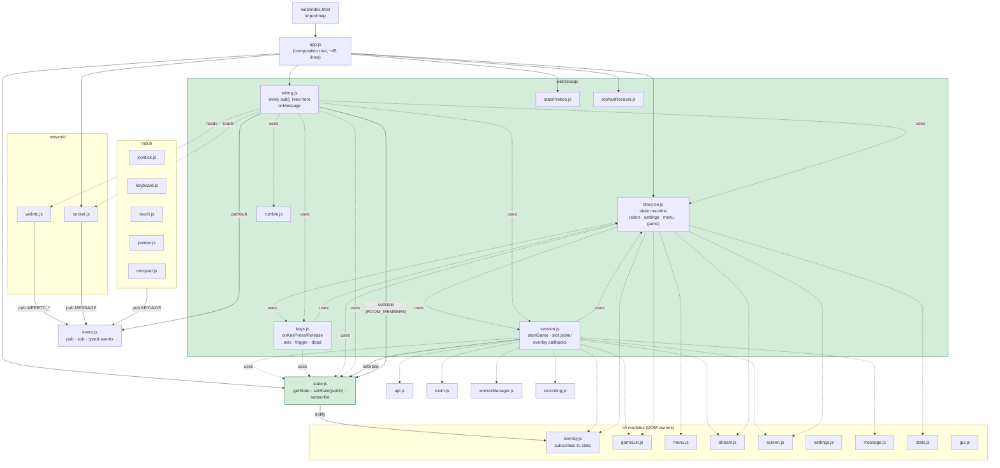

# Frontend architecture

> Update this diagram when you change how the frontend is structured.
> See [../CLAUDE.md](../CLAUDE.md) for what counts as "structural".

Entry: `web/index.html` → ESM import map → `web/js/app.js`.
Served from moon's `~/containers/cloudretro-phase3/web/` (bind-mounted, read-only into container). Rsync-deployed via `/deploy-cloudplay-frontend`; no rebuild.



## Data-flow quick reference

```
Server ── msg ──▶ socket ── pub MESSAGE ──▶ wiring.onMessage
                                                   │
                                                   ├──▶ pub(WEBRTC_*)    ── webrtc consumes
                                                   ├──▶ pub(GAME_*)      ── wiring subs
                                                   └──▶ setState(...)    ── state.js
                                                                               │ notify
                                                                               ▼
                                                                          subscribers
                                                                          (overlay …)
```

## Notable invariants

- **Every `sub()` call lives in `wiring.js`** (except a small set of module-local subs in `screen.js`, `stream.js`, `keyboard.js`, `touch.js`, `settings.js`, `workerManager.js`, `statsProbes.js`). New subs should default to wiring.
- **`setState(patch)` and `setAppState(...)` are the only sanctioned writers** of cross-module state. Direct mutation of `getState()` is a bug.
- **Circular imports** between `lifecycle ↔ session ↔ keys` are load-safe because every circular reference is called at runtime, not at module init. Adding a top-level expression that evaluates one of these bindings immediately is a footgun — put it inside a function.
- **`?v=__V__` placeholder** in every import gets stamped by `scripts/version.sh` at deploy time (`/deploy-cloudplay-frontend`). No per-file manual bumps.
